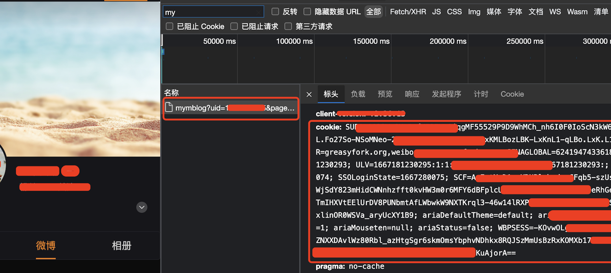
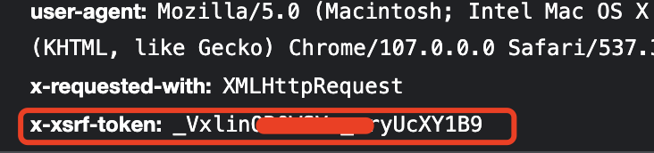
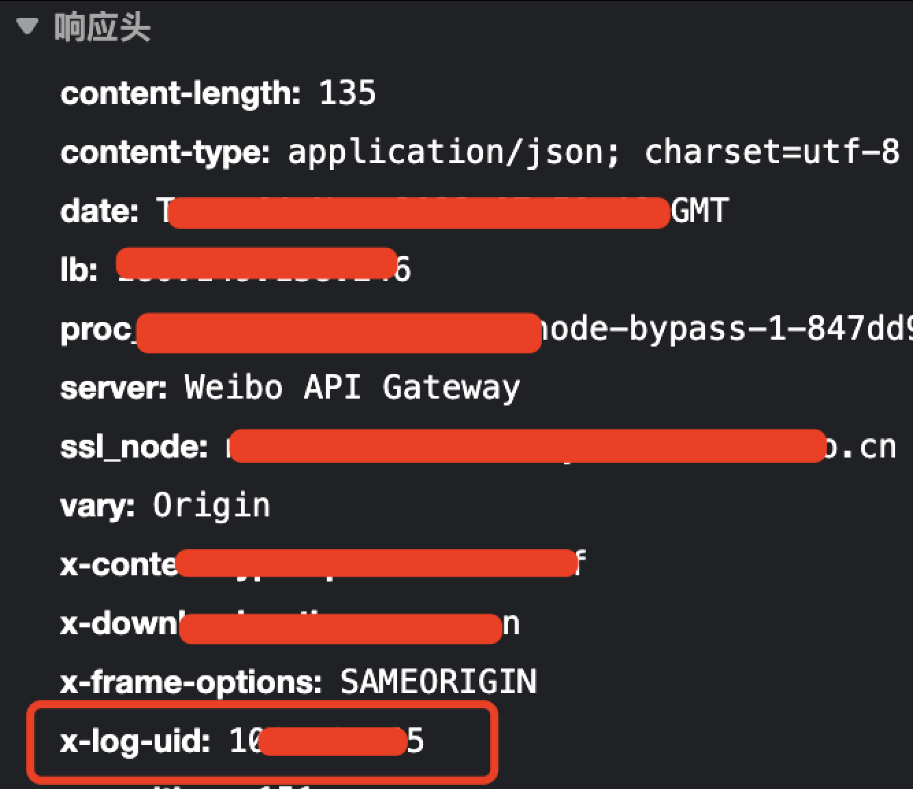

# Clear weibo

#### 介绍  
一键清空个人名下所有微博。注意：**清空后数据无法恢复！**

#### 使用说明  
1. 初始化.env配置文件：`cd app;cp env.example .env;`
2. 编辑 .env，具体参数需要通过微博网页版获取到：
```ini
UID=xxx
COOKIE=xxx=xxxx
X_XSRF_TOKEN=xxx
```
打开微博网页版http://weibo.com/，进入个人中心，打开浏览器调试模式：

`最快捷的方法,快捷键 ctrl+shift+j(i) ，或者F12 就能进入调试模式`

在搜索框中搜索mymblog关键词，找到请求，然后在标头中找到cookie，x-xsrf-token，x-log-uid

获取这三个数值，填写到.env中。








3. `go run clean-wb.go`
   或者编译为对应平台的binary，在app目录下跑 `./clean-wb`

#### 已知问题  
1. 脚本删除较多微博时会被微博拦截请求。可以停止脚本（ctrl+c），等待几分钟后重新跑。

